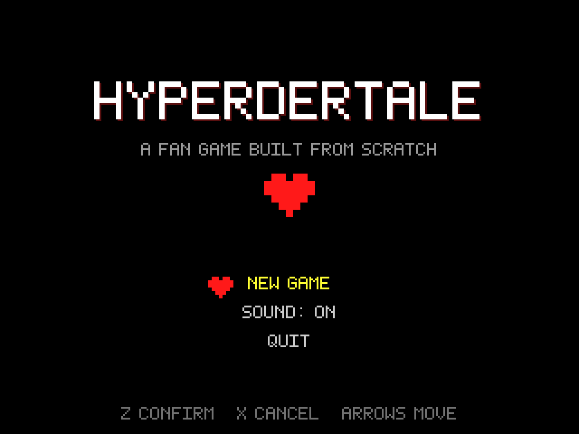
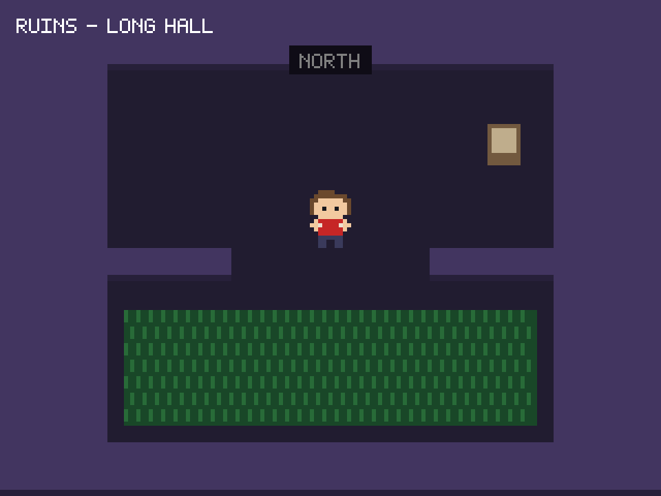
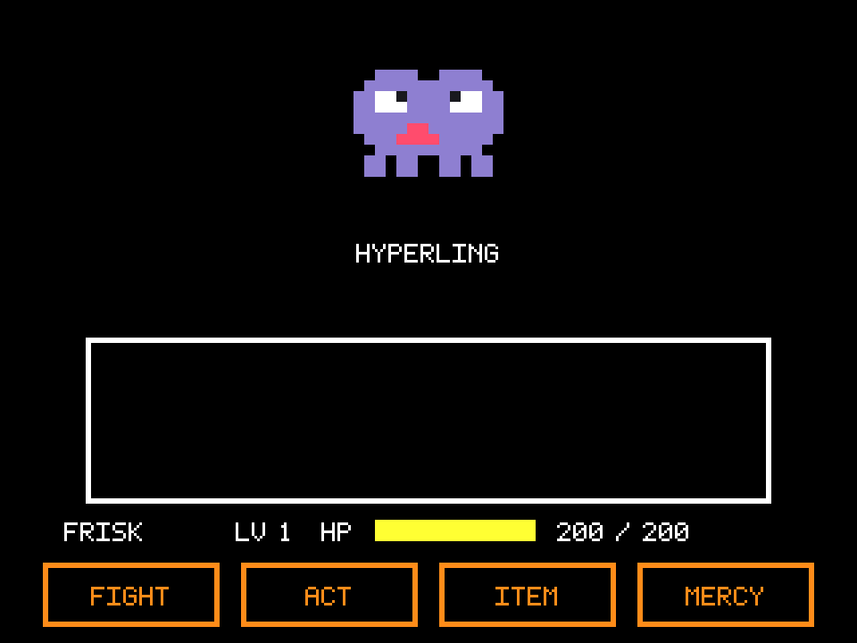
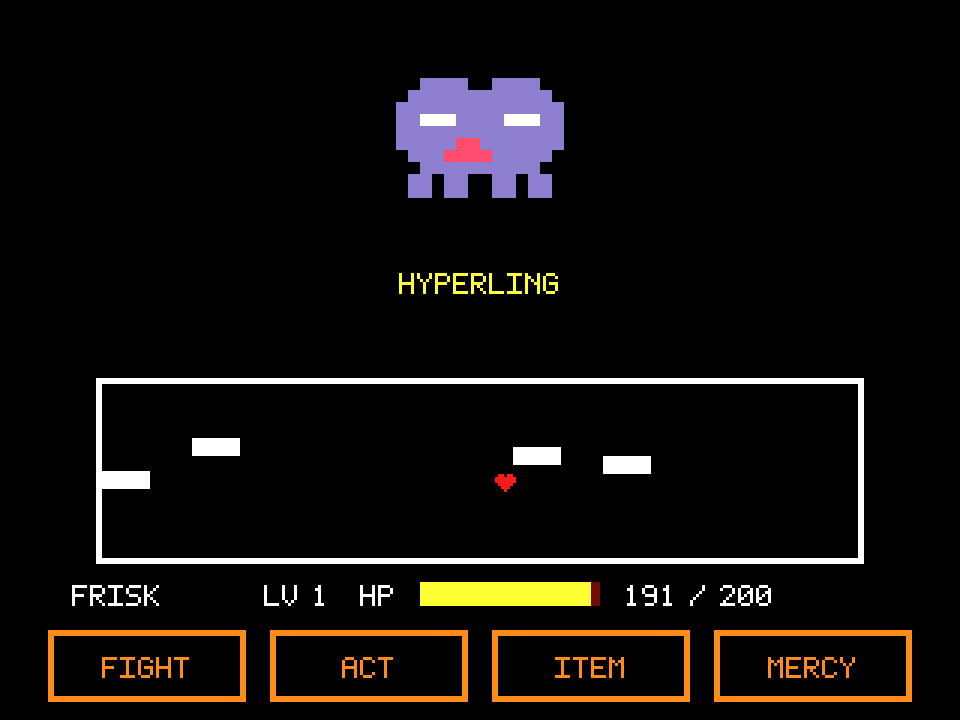

# Hyperdertale

Undertale'den ilham alan, **sıfırdan yazılmış** bir fan oyunu. LÖVE 2D (Lua) ile
yazıldı; Windows, Linux ve Android için gerçek uygulama olarak paketlenir.



## Bu depoda ne yok

Hyperdertale, Undertale'in kodunu, müziğini, sprite'larını veya odalarını
**içermez**. Toby Fox ile ya da Undertale ile hiçbir bağlantısı yoktur.

Buradaki her şey bu depoda üretiliyor:

- **Yazı tipi** — 5x7 bitmap font, `src/font.lua` içinde çalışma anında atlas
  olarak oluşturuluyor.
- **Grafikler** — bütün sprite'lar `src/sprites.lua` içinde karakter haritası;
  odalar ve arayüz kodla çiziliyor. Depoda tek bir görsel dosya yok.
- **Müzik ve sesler** — `src/audio.lua` içindeki nota tabloları WebAudio değil,
  LÖVE'ın `SoundData`'sına kare/üçgen dalga olarak sentezleniyor. Ses dosyası da yok.

Oyunun *mekanikleri* türün ortak dili (kalp/SOUL, mermi kaçınma, FIGHT/ACT/ITEM/MERCY);
bunları kendi kodumuzla uyguladık.

## Oynanış

| Overworld | Savaş | Kaçınma |
|---|---|---|
|  |  |  |

- **Overworld** — çarpışmalı gezinti, NPC diyalogları, kaydetme yıldızı, tabelalar,
  odalar arası kapılar ve uzun otlarda rastgele karşılaşmalar.
- **Savaş** — dört düğmeli menü, zamanlamalı saldırı çubuğu, dört farklı mermi
  deseni, ACT ile merhamet yolu ve SPARE ile öldürmeden bitirme.
- **İlerleme** — EXP/LV eğrisi, HP/AT/DF, eşyalar, altın, oynama süresi; kayıt
  LÖVE'ın kendi kayıt dizininde tutulur (Windows'ta `%APPDATA%`, Android'de
  uygulamaya özel alan).

## Kontroller

| Eylem | Klavye | Gamepad | Dokunmatik |
|---|---|---|---|
| Hareket | Yön tuşları / WASD | D-pad veya sol analog | Ekrandaki D-pad |
| Onayla | Z / Enter / Space | A | **Z** düğmesi |
| İptal / Koş | X / Shift | B veya X | **X** düğmesi |
| Menü | C / Ctrl / Esc | Y veya Start | **C** düğmesi |
| Tam ekran | F11 | – | – |
| Sesi kıs | M | – | Başlık menüsü |

Dokunmatik kontroller Android'de otomatik açılır. Masaüstünde test etmek için
**F1**'e basın: aynı ekran düğmeleri fareyle çalışır.

## Çalıştırma

LÖVE 11.4 veya üstü gerekir.

```bash
love .
```

Ya da depo kökünü `.love` olarak paketleyip çalıştırın:

```bash
zip -9 -r hyperdertale.love . -x '.git/*' '.github/*' 'docs/*' '*.md'
love hyperdertale.love
```

## Uygulama sürümleri (GitHub Actions)

Her push'ta iki iş akışı çalışır ve çıktıları **Actions → ilgili çalıştırma →
Artifacts** altından indirilir:

| İş akışı | Çıktı | Not |
|---|---|---|
| `build.yml` | `Hyperdertale-windows-x64.zip` | LÖVE çalışma zamanı `.exe`'ye kaynaştırılmış taşınabilir sürüm; kurulum gerektirmez |
| `build.yml` | `Hyperdertale-x86_64.AppImage` | Linux |
| `build.yml` | `hyperdertale.love` | Her platformda LÖVE ile açılır |
| `android.yml` | `Hyperdertale-app-*.apk` | `love-android` üzerinden derlenen debug imzalı APK |

`build.yml` ayrıca her `.lua` dosyasını `luac -p` ile derleyip sözdizimi
hatalarını CI'da yakalar.

**Sürüm yayınlamak için** `v` ile başlayan bir etiket atın; Actions çıktıları
otomatik olarak GitHub Release'e yüklenir:

```bash
git tag v0.1.0 && git push origin v0.1.0
```

APK debug anahtarıyla imzalanır: telefona doğrudan kurulur, ancak Play Store'a
yüklemek için kendi release anahtarınızla imzalamanız gerekir.

## Proje yapısı

```
main.lua              pencere ölçekleme, ana döngü, giriş olayları
conf.lua              LÖVE penceresi ve modül ayarları
src/
  game.lua            sahne kaydı, sahne geçişleri, kararma efekti
  input.lua           klavye + gamepad + dokunmatik tek katmanda
  draw.lua            320x240 mantıksal ekran için çizim yardımcıları
  font.lua            5x7 bitmap font üreteci
  sprites.lua         karakter haritası olarak bütün sprite'lar
  audio.lua           chiptune sentezleyici (müzik + efektler)
  save.lua            oyuncu durumu ve kayıt dosyası
  textbox.lua         daktilo efektli diyalog kutusu
  data/
    items.lua         eşyalar
    enemies.lua       canavarlar, ACT seçenekleri, replikler
    patterns.lua      mermi desenleri
  scenes/
    title.lua         başlık ekranı ve ana menü
    overworld.lua     gezinti, diyalog, kaydetme, karşılaşmalar
    battle.lua        savaş sistemi
    gameover.lua      ölüm ekranı
```

## İçerik eklemek

- **Yeni oda** — `src/scenes/overworld.lua` içindeki `ROOMS` tablosuna bir giriş
  ekleyin: `walls`, `entities` (npc / save / sign / door) ve isterseniz `grass` +
  `encounter`.
- **Yeni canavar** — `src/data/enemies.lua` içine HP, ATK, DEF, `acts` listesi ve
  kullanacağı desen adlarını yazın; `src/sprites.lua`'ya sprite'ını ekleyin.
- **Yeni mermi deseni** — `src/data/patterns.lua` içine `duration`, `start` ve
  `update` alanları olan bir tablo ekleyin; `update` içinde `ctx.spawn{...}`
  çağırın. Kutuya kırpma ve çarpışma savaş sahnesinde hallediliyor.
- **Yeni müzik** — `src/audio.lua` içindeki `songs` tablosuna nota listesi ekleyin.

## Lisans

Kod ve varlıklar MIT lisansı altında — bkz. [LICENSE](LICENSE).
Undertale, Toby Fox'un eseridir ve bu proje ile bir ilişkisi yoktur.

---

## English summary

Hyperdertale is an Undertale-inspired fan game written from scratch in LÖVE 2D.
It contains **no** Undertale code, art, music or rooms: the font, sprites and the
entire soundtrack are generated at runtime from data in `src/`. GitHub Actions
builds a portable Windows `.exe`, a Linux AppImage, a `.love` package and an
Android `.apk` on every push, and attaches them to a GitHub Release on a `v*` tag.
Touch controls are built in and appear automatically on Android.
